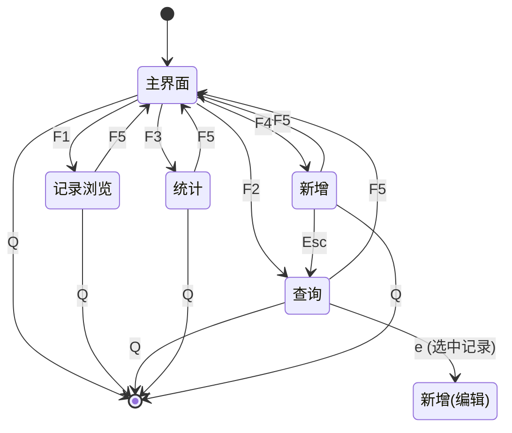

# TerMark 仓买管理系统

一个基于终端用户界面（TUI）的仓库进销存管理系统，使用 C11 语言编写，支持鼠标操作、键盘快捷键，数据以 CSV 格式持久化存储。
本项目是我数据结构课程设计的代码部分，用以帮助被一些变态但毫无意义课设折磨的同学作为参考。

---

## 目录

- [功能概览](#功能概览)
- [项目架构](#项目架构)
- [模块说明](#模块说明)
- [数据结构](#数据结构)
- [数据格式](#数据格式)
- [构建与运行](#构建与运行)
- [操作指南](#操作指南)
- [界面导航](#界面导航)
- [终端兼容性](#终端兼容性)
- [扩展与定制](#扩展与定制)

---

## 功能概览

| 功能 | 快捷键 | 描述 |
|------|--------|------|
| 浏览记录 | `F1` | 分页浏览所有进货/卖出记录，支持鼠标滚轮和 j/k 滚动 |
| 查询商品 | `F2` | 按商品编号或名称模糊查询，支持行选中、编辑、删除 |
| 分类统计 | `F3` | 按商品汇总进货量、卖出量、当前库存 |
| 新增记录 | `F4` | 表单式录入进货或卖出记录，按 Tab 切换字段 |
| 数据持久化 | 自动 | 退出时自动保存至 `data.csv`，启动时自动加载 |

核心业务逻辑：

- **库存计算**：当前库存 = 该商品总进货量 − 总卖出量
- **模糊查询**：输入关键字同时匹配商品编号（`productId`）和商品名称（`name`）
- **数据校验**：数量必须 > 0，日期格式为 `YYYY-MM-DD`，交易类型仅限 0（进货）或 1（卖出）
- **唯一 ID**：每条记录通过时间戳 + 随机数生成唯一标识

---

## 项目架构

```
storage_management/
├── README.md                  # 项目文档（本文件）
├── xmake.lua                  # xmake 构建配置
├── inc/                       # 头文件
│   ├── data.h                 # 链表数据结构与基本操作
│   ├── csv.h                  # CSV 文件读写
│   ├── inventory.h            # 数据校验与库存计算
│   ├── modify.h               # 记录修改
│   ├── query.h                # 记录查询（精确/模糊）
│   ├── stat.h                 # 统计汇总
│   ├── ui.h                   # 主界面定义（屏幕枚举、UIState）
│   ├── ui_data.h              # TUI 数据格式化辅助
│   └── tuibox.h               # 自制 TUI 框架库
└── src/                       # 源文件
    ├── main.c                 # 入口，启动 UI 主循环
    ├── data.c                 # 链表实现（创建/插入/查找/删除/释放）
    ├── csv.c                  # CSV 读写实现
    ├── inventory.c            # 校验函数与库存计算实现
    ├── modify.c               # 记录修改实现
    ├── query.c                # 查询功能实现
    ├── stat.c                 # 统计汇总实现
    ├── ui.c                   # 界面绘制、事件处理、导航逻辑
    └── ui_data.c              # 表格/查询结果字符串构建
```

模块依赖关系：

```mermaid
graph TD
    main.c --> ui.h
    main.c --> csv.h
    ui.c --> ui.h
    ui.c --> csv.h
    ui.c --> modify.h
    ui.c --> query.h
    ui.c --> ui_data.h
    ui_data.c --> ui_data.h
    ui_data.h --> data.h
    ui_data.h --> inventory.h
    ui_data.h --> stat.h
    csv.h --> data.h
    inventory.h --> data.h
    modify.h --> data.h
    modify.h --> inventory.h
    query.h --> data.h
    stat.h --> data.h
    data.h --> stdlib
    tuibox.h --> stdlib, termios, sys/ioctl
```

---

## 模块说明

### `data.h` / `data.c` — 数据层

核心数据结构为单向链表，每个节点表示一条进货或卖出记录：

```c
typedef struct Node {
  long long id;       // 唯一标识（时间戳 + 随机数）
  char productId[32]; // 商品编号
  char category[32];  // 类别
  char name[64];      // 商品名称
  int quantity;       // 数量
  char date[16];      // 日期 (YYYY-MM-DD)
  int flag;           // 0=进货, 1=卖出
  struct Node *next;  // 下一节点
} Node;
```

提供操作：

| 函数 | 功能 |
|------|------|
| `createNode()` | 创建节点（自动生成 ID） |
| `createNodeWithId()` | 创建节点（指定 ID，用于 CSV 加载） |
| `insertNode()` | 尾插法插入链表 |
| `findById()` | 按 ID 查找 |
| `findByProductId()` | 按商品编号查找首个匹配 |
| `findByName()` | 按商品名称查找首个匹配 |
| `deleteById()` | 按 ID 删除节点 |
| `freeList()` | 释放整个链表 |

### `csv.h` / `csv.c` — 持久化层

| 函数 | 功能 |
|------|------|
| `saveCSV(filename)` | 将链表全部记录写入 CSV 文件（含表头） |
| `loadCSV(filename)` | 从 CSV 文件读取记录并还原为链表（跳过表头） |

CSV 编码为纯文本，字段之间用逗号分隔，易于在 Excel / LibreOffice 中查看和编辑。

### `inventory.h` / `inventory.c` — 业务校验与库存

| 函数 | 功能 |
|------|------|
| `validateDate()` | 校验日期格式 YYYY-MM-DD |
| `validateFlag()` | 校验交易类型为 0 或 1 |
| `validateQuantity()` | 校验数量 > 0 |
| `getStockByProductId()` | 按编号计算当前库存 |
| `getStockByName()` | 按名称计算当前库存 |
| `getTotalIn()` | 统计某商品总进货量 |
| `getTotalOut()` | 统计某商品总卖出量 |

库存公式：$库存 = \sum_{进货} 数量 - \sum_{卖出} 数量$

### `modify.h` / `modify.c` — 修改记录

| 函数 | 功能 |
|------|------|
| `modifyRecordById()` | 按 ID 修改记录的所有字段（含数据校验） |
| `printRecordsByProductId()` | 按商品编号打印全部记录 |
| `printRecordsByName()` | 按商品名称打印全部记录 |

### `query.h` / `query.c` — 查询与模糊搜索

| 函数 | 功能 |
|------|------|
| `queryByProductId()` | 按商品编号精确查询 |
| `queryByName()` | 按商品名称精确查询 |
| `queryStockByProductId()` | 按编号查询库存 |
| `queryStockByName()` | 按名称查询库存 |
| `fuzzyQuery()` | 模糊查询（匹配 productId 或 name 包含关键字） |

模糊查询使用 `strstr()` 实现子串匹配，同时搜索商品编号和名称字段。

### `ui_data.h` / `ui_data.c` — 格式化辅助

将链表数据格式化为表格字符串，供 TUI 渲染使用：

| 函数 | 说明 |
|------|------|
| `buildRecordTable()` | 构建全部记录表格 |
| `buildRecordHeader()` | 构建表头 |
| `buildQueryResultByProductId()` | 按编号构建查询结果 |
| `buildQueryResultByName()` | 按名称构建查询结果 |
| `buildFuzzyQueryResult()` | 构建模糊查询结果 |
| `buildStatisticsTable()` | 构建统计汇总表 |
| `getRecordCount()` | 获取记录总数 |

### `ui.h` / `ui.c` — 用户界面

定义了四个屏幕页面：

| 屏幕 | 枚举值 | 说明 |
|------|--------|------|
| 主界面 | `SCREEN_MAIN` | 显示功能菜单和快捷键提示 |
| 记录浏览 | `SCREEN_RECORD` | 分页浏览全部记录 |
| 查询 | `SCREEN_QUERY` | 输入框 + 模糊查询 + 结果选择 + 删除/编辑 |
| 统计 | `SCREEN_STAT` | 汇总每个商品的进销存统计 |
| 新增/编辑 | `SCREEN_ADD` | 表单录入新增记录或编辑已有记录 |

配色方案为青-橙双色（Cyan/Orange），支持：

- UTF-8 中文显示与对齐
- 鼠标单击选择行、滚轮滚动
- 右侧滚动条指示器
- ANSI 转义序列渲染

### `tuibox.h` — 引入的 TUI 框架

嵌入式单头文件 TUI 库，功能包括：

- 盒模型（box）布局：每个 UI 元素是一个矩形区域，可绑定绘制函数、点击回调、悬停回调
- 鼠标支持：支持 SGR 鼠标编码（单击、滚轮）
- 键盘事件：注册自定义按键序列与回调函数
- 双缓冲渲染：缓存上次绘制内容，仅在变化时重绘
- 文本输入：支持 ASCII 及 UTF-8 多字节字符输入、退格
- 终端管理：进入/退出 raw 模式，切换备用屏幕（alt screen）
- 内置 `vec.h`（rxi/vec）：类型安全的动态数组宏库

---

## 数据格式

### CSV 文件结构 (`data.csv`)

```csv
id,productId,category,name,quantity,date,flag
1749200000001,P001,水果,苹果,100,2026-06-01,0
1749200000002,P001,水果,苹果,30,2026-06-03,1
```

| 列名 | 类型 | 说明 |
|------|------|------|
| `id` | `long long` | 记录唯一标识（Unix 时间戳毫秒） |
| `productId` | `string(31)` | 商品编号 |
| `category` | `string(31)` | 商品类别 |
| `name` | `string(63)` | 商品名称 |
| `quantity` | `int` | 交易数量（> 0） |
| `date` | `string(15)` | 交易日期，格式 YYYY-MM-DD |
| `flag` | `int` | `0` = 进货（入库），`1` = 卖出（出库） |

---

## 构建与运行

### 前置依赖

- [xmake](https://xmake.io) 构建工具
- GCC 或 Clang（支持 C11）
- Linux 终端（需要 termios 支持）

### 快速开始

```bash
# 进入项目目录
cd storage_management

# 构建（默认 debug 模式）
xmake

# 构建 release 版本
xmake f -m release
xmake

# 运行
xmake run

# 或直接执行二进制文件
./build/linux/x86_64/debug/storage_management
```

### 构建配置

`xmake.lua` 中的关键配置：

```lua
set_languages("c11")                          # C11 标准
add_rules("mode.debug", "mode.release")       # debug/release 模式
add_files("src/*.c")                          # 编译所有源文件
add_includedirs("inc")                        # 头文件搜索路径
```

---

## 操作指南

### 主界面

启动后进入主界面，显示功能菜单：

```
    [F1] 浏览记录
    [F2] 查询商品
    [F3] 分类统计
    [F4] 新增记录
    [F5] 提示

    [Q]  退出
```

### 浏览记录 (`F1`)

- 显示所有记录的表格视图
- **滚动**：鼠标滚轮 或 `j`（下）/ `k`（上）
- 右侧有滚动条指示当前位置
- **返回**：`q` 退出程序，`F5` 回主界面

### 查询商品 (`F2`)

- 顶部有输入框，键入关键字后按 `Enter` 执行模糊查询
- 查询匹配商品编号或名称中包含关键字的记录
- **单击**某行：选中（高亮反色显示）
- `d` 键：删除选中记录（需 `y` 确认 / `n` 取消）
- `e` 键：编辑选中记录（进入编辑表单）
- `Esc`：清空输入/取消选中/取消确认
- **返回**：`q` 退出程序，`F5` 回主界面

### 分类统计 (`F3`)

- 按商品汇总，显示每个商品的类别、编号、名称、进货量、卖出量、库存
- 支持 `j`/`k` 和鼠标滚轮滚动
- 右侧滚动条指示

### 新增记录 (`F4`)

- 逐字段填写表单：
  1. 商品编号
  2. 类别
  3. 名称
  4. 数量
  5. 日期（自动填入当天日期）
  6. 交易类型（进货/卖出）
- **操作**：
  - `Enter` / `Tab`：确认当前字段，切换到下一个
  - `←` `→`：在"进货"和"卖出"之间切换
  - `Esc`：取消并返回查询页
  - 所有字段填完后自动提交，支持连续录入

### 编辑记录

- 在查询页选中一条记录后按 `e`，进入编辑表单
- 表单预填原有数值，修改后按 `Tab` / `Enter` 逐字段确认并最终提交
- 提交后自动返回查询页并刷新结果

### 退出程序

- 按 `q` 或关闭终端
- 退出时**自动保存**链表数据到 `data.csv`

---

## 界面导航



---

## 终端兼容性

推荐使用以下 GPU 加速终端以获得最佳体验（减少闪烁）：

- [Alacritty](https://alacritty.org)
- [Kitty](https://sw.kovidgoyal.net/kitty/)
- [WezTerm](https://wezfurlong.org/wezterm/)

在 tmux / screen 等终端复用器下也可运行，但可能存在轻微闪烁。

### 必需终端特性

- ANSI 转义序列支持（光标移动、颜色、清屏）
- SGR 鼠标编码（`?1003h`, `?1006h`）
- 备用屏幕缓冲区（`?1049h`）
- Raw 模式（termios 非规范输入）

---

## 扩展与定制

### 添加新商品类别

直接在新增记录（`F4`）中填写新的类别名称即可，系统不限制类别枚举值。

### 修改数据文件路径

在 `src/main.c` 中修改 `loadCSV()` 和 `saveCSV()` 的调用参数：

```c
loadCSV("your_file.csv");
// ...
saveCSV("your_file.csv");
```

### 调整配色

在 `src/ui.c` 顶部修改 ANSI 颜色宏：

```c
#define C_CYAN   "\x1b[1;36m"   // 青色（标题/表头）
#define C_ORANGE "\x1b[1;33m"   // 橙色（快捷键/高亮）
#define C_RESET  "\x1b[0m"      // 重置样式
#define C_DIM    "\x1b[2m"      // 暗淡文字（提示）
```

ANSI 8 色标准码：30-37（前景）、40-47（背景）、加粗 `1;`、暗淡 `2;`。

### 重新初始化数据

删除 `data.csv` 后重新运行程序，程序将启动空链表，退出时自动创建新的 `data.csv`。

---

## 开发信息

- **项目名称**：TerMark 仓买管理系统
- **版本**：v1.0.0
- **作者**：HelixCopex i@sloray.com
- **语言**：C11
- **构建工具**：xmake
- **许可**：MIT


